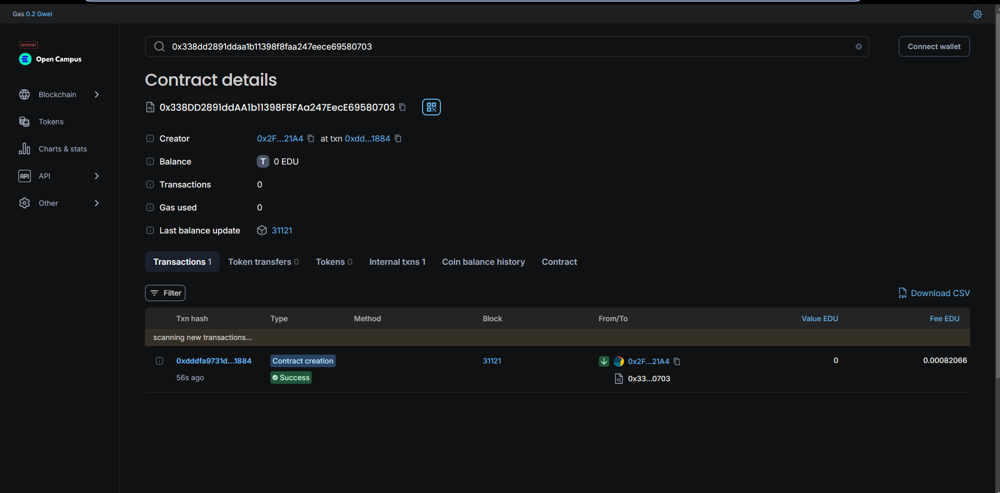

# StudentRegistry Smart Contract

## Vision


The **StudentRegistry** smart contract is designed to manage student records on the Ethereum blockchain. It allows for the secure addition, modification, viewing, and deletion of student data, ensuring that only the contract owner has control over these actions. This contract aims to provide a transparent, immutable record of student information that can be accessed and managed efficiently.

## Flowchart
Below is a simplified flowchart illustrating the main functionalities of the **StudentRegistry** contract:

```
          +----------------+
          | Add Student    |
          +--------+-------+
                   |
                   v
          +--------+-------+
          | Edit Student   |
          +--------+-------+
                   |
                   v
          +--------+-------+
          | View Student   |
          +--------+-------+
                   |
                   v
          +--------+-------+
          | Delete Student |
          +--------+-------+
                   |
                   v
          +--------+-------+
          | Is Registered  |
          +----------------+
```

## Contract Addresses
- **Network**:Edu Chain
- **Contract Address**:0x338dd2891ddaa1b11398f8faa247eece69580703
- **Admin ID**:0x2FC81Fb781088dF45Cd3cFa7B02368a39b8c21A4



## Functions

- **addStudent**: Adds a new student record. Accessible only by the contract owner.
- **editStudent**: Edits an existing student record. Accessible only by the contract owner.
- **viewStudent**: Retrieves the student information based on registration number.
- **deleteStudent**: Deletes a student record. Accessible only by the contract owner.
- **isRegistered**: Checks if a student is registered based on the registration number.

## Future Scope
1. **Role-based Access Control**: Introduce roles (e.g., administrators, teachers) to allow different levels of access and functionality.
2. **Enhanced Data Validation**: Implement additional validation checks for data input to ensure accuracy and integrity.
3. **User Interface Integration**: Develop a front-end application to interact with the smart contract, making it user-friendly.
4. **Audit Logs**: Add functionality to log changes made to student records for better traceability.

## Contact
For any questions or feedback regarding this project, please reach out to:

- **Name**: Debaraj Roy
- **Email**: debarajroy82@gmail.com
- **Linkedln**:https://www.linkedin.com/in/debaraj-roy-3a0b6a257/
- **Github**:https://github.com/its277

---